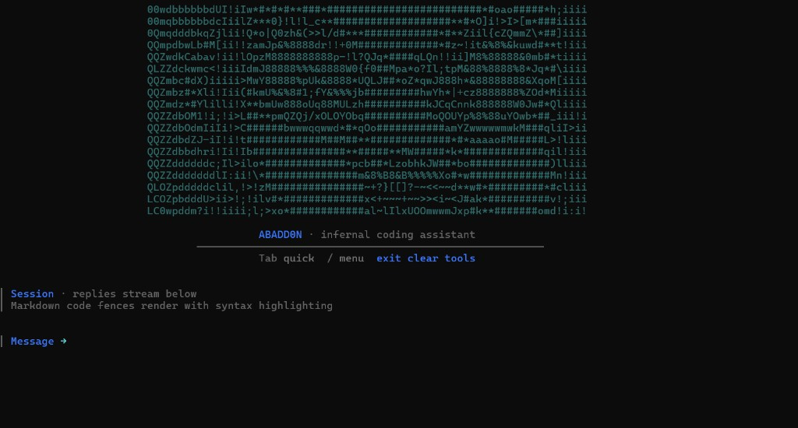

<p align="center">
  
</p>

# **ABADDON** · *infernal coding assistant*

> **⚠️ WORK IN PROGRESS (WIP)**  
> This vessel is still awakening. Expect breaking changes and ominous prophecies.

**Abadd0n** is a custom-architected LLM and AI agent designed for high-efficiency training and inference on consumer hardware (4 GB VRAM budget). It mimics modern design patterns from Llama-3 and Qwen3 to provide a powerful, character-driven experience. Engage via a stylized terminal chat: Tab quick actions, `/` slash menu, **Right arrow** for predictive text (history + common phrases), syntax highlighting, and ClawHub skills.

---

## 🏗️ Architecture Highlights
Abadd0n uses a decoder-only transformer architecture with:
- **Grouped Query Attention (GQA)**: 8 query heads / 2 KV heads for reduced VRAM usage.
- **SwiGLU Activation**: Parallel gate and up projections for superior reasoning.
- **RMSNorm**: Faster, stable normalization (Pre-norm configuration).
- **RoPE (Rotary Positional Embeddings)**: Modern relative position encoding.
- **No Positional Embedding Table**: Position is handled entirely by RoPE.

## 🚀 Features
- **Unsloth Integration**: Optimized for 2x faster 4-bit QLoRA fine-tuning.
- **Core Platform**: Gateway (WS control), agent (RPC), session model, media pipeline stubs. CLI: `gateway`, `agent`, `send`, `onboarding`, `doctor`.
- **CLI**: Slash menu (`/`), Tab quick actions, **Right arrow** predictive text (suggestions from history + common phrases), syntax highlighting, file tools (`/read`, `/ls`, `/find`, `/tree`, `/compile`, `/learn`).
- **Math & search**: Chat accepts "what is 2+3*4", "whats 10x10", "search for Python tutorial", "google asyncio" — math is evaluated directly (`x` and `×` treated as multiplication); search enriches context via Google. `/math` and `/search` slash commands also work.
- **ClawHub skills**: Interactive search bar (`/skills`), browse, search, and install [OpenClaw skills](https://clawhub.ai) via `/skills install <slug>` (add `--global` for all projects); skills injected into agent.
- **Docs & fetch**: `/docs <query>` searches [docs.openclaw.ai](https://docs.openclaw.ai); `/fetch <url>` retrieves page content; `/patch <file>` applies OpenClaw-style patches.
- **DPO (Direct Preference Optimization)**: Alignment script included for human preference tuning.
- **Character-Level Pre-training**: A foundational training script for small-scale experiments from scratch.
- **Stylized Terminal Chat**: Engage with the entity through a custom, demonic terminal interface.

## 📂 Project layout
| Path | Role |
|------|------|
| `cli.py` | CLI entry: `gateway`, `agent`, `send`, `onboarding`, `doctor`; default = chat |
| `main.py` | Chat UI (loads `lora_model/`, Unsloth + Qwen3); also accepts subcommands |
| `core/` | Platform: gateway (WS control), agent (RPC), session model, media pipeline |
| `core/agent.py` | RPC runtime: tool streaming, block streaming; single-turn `--message` or interactive |
| `core/doctor.py` | Diagnostics: PyTorch, pre_unsloth, Unsloth import (run via `cli.py doctor`) |
| `core/tools.py` | Tool impls: read_file, write_file, list_dir, find_in_files, run_bash, compile_python, apply_patch |
| `core/clawhub.py` | ClawHub API client (search, download); loads `project/skills/*/SKILL.md` + `ABADDON_SKILLS_DIR` into agent |
| `core/docs_openclaw.py` | OpenClaw docs search (docs.openclaw.ai/llms.txt) |
| `core/web_fetch.py` | URL fetch with HTML-to-text extraction |
| `core/math_tool.py` | Safe math evaluation (arithmetic, sqrt, sin, etc.) |
| `core/web_search.py` | Web search via Google (no API key) |
| `ascii_banner.txt` | Optional startup ASCII art (cropped to terminal; replace to customize) |
| `cli_theme.py` | CLI design system (colors, icons, spacing per [CLI guidelines](https://yannglt.com/writing/designing-for-command-line-interface)) |
| `coding_tools.py` | Local `/read`, `/ls`, `/find`, `/tree`, `/compile`, `/learn`; `/docs`, `/fetch`, `/patch`; `/skills` (ClawHub) |
| `pre_unsloth.py` | Env prep before `import unsloth` (caches + compatibility shims for torch.compile options) |
| `unsloth_lora_train.py` | QLoRA SFT (`dataset.jsonl` → `lora_model/`) |
| `export_hf.py` | Push LoRA/merged/GGUF to Hugging Face Hub |
| `persona.py` | Shared Abadd0n system persona for main.py chat |
| `dpo_train.py` | DPO alignment (optional, after SFT) |
| `train.py` | Character-level pre-train (`llm.py` + `data.txt`) |
| `llm.py` | Small custom decoder for `train.py` |
| `dataset_builder.py` | Helpers for building / checking data |
| `venv_check.py` | Ensures main/export/train run inside venv_win, venv_wsl, or venv |
| `check_torch.py`, `debug_unsloth.py` | Diagnostics |
| `requirements.txt` | Windows + CUDA 12.1 PyTorch stack + googlesearch-python (full install) |
| `setup.bat` | `cd` to repo, creates `venv_win\`, `pip install -r requirements.txt`, verifies PyTorch + `pre_unsloth` inductor compat |
| `linux/setup_wsl.sh` | WSL: caches under `~/.cache`, `requirements_wsl.txt`, runs `linux/wsl_check.py` (full Unsloth import) |
| `linux/setup.sh` | Native Linux: `venv/` + CPU PyTorch + `requirements_wsl.txt` + `pre_unsloth` check; on WSL delegates to `setup_wsl.sh` |
| `linux/requirements_wsl.txt` | Unsloth + TRL + pinned HF + rich/readchar + web search (no PyTorch — install torch in venv first on Linux) |
| `linux/wsl_check.py` | Torch + `pre_unsloth` + inductor assert + `import unsloth` (use after Linux/WSL install) |
| `clean.bat` | Windows: remove `__pycache__`, `unsloth_compiled_cache`, old export dirs (`abadd0n_merged`, `abadd0n_gguf`, `abadd0n_gguf_gguf`), test artifacts (keeps lora_model, outputs) |
| `linux/clean.sh` | Linux/WSL: same cleanup |

| `assets/abaddon-cli.png` | README hero image (CLI screenshot) |
| `tests/` | Unit tests: `test_tools.py` for tools, `/docs`, `/fetch` |

Generated / local-only (see `.gitignore`): `lora_model/`, `outputs/`, `unsloth_compiled_cache/`, `abadd0n_merged/`, `abadd0n_gguf/`, `abadd0n_gguf_gguf/`, `venv_win/`, `venv_wsl/`, `venv/`, `conversations/`, `__pycache__/`.

---

## Prerequisites (all platforms)
- **Python 3.10+** on `PATH` (`python` / `python3`).
- **NVIDIA GPU + driver** for CUDA training and chat (CPU-only is not supported for the Unsloth path in this repo).
- **Disk**: a few GB for the base model download and checkpoints; more for experiments.
- **Optional**: [Hugging Face token](https://huggingface.co/settings/tokens) for gated models — set `HF_TOKEN` in the environment if a script asks for it.

---

## Windows — exact setup

1. Open **Command Prompt** or **PowerShell** and go to the repo:
   ```bat
   cd C:\Users\YOUR_USER\Abadd0n-4B
   ```
   (Use your real path.)

2. Run the installer (creates `venv_win` next to `requirements.txt` and installs CUDA 12.1 PyTorch + Unsloth stack):
   ```bat
   setup.bat
   ```
   Wait until it finishes. The script switches to its own directory (so `pre_unsloth` imports work). If `venv_win` already exists, it reuses it and reinstalls/upgrades from `requirements.txt`. The last steps verify PyTorch and that `pre_unsloth` registered GRPO-related inductor options (no full Unsloth download in that check).

3. **Every new terminal** before `python`:
   ```bat
   cd C:\Users\YOUR_USER\Abadd0n-4B
   venv_win\Scripts\activate
   ```

4. **Verify GPU** (optional):
   ```bat
   python check_torch.py
   ```

---

## WSL2 (Ubuntu) — exact setup

> **⚠️ Untested:** The Linux/WSL install and environment have not been verified. The instructions below are provided as-is; use at your own risk and expect possible adjustments.

Repo on `\\wsl$\...` or `/mnt/c/...` is fine; first Unsloth import is **much faster** if the project lives under your Linux home (e.g. `~/code/Abadd0n-4B`).

### A) Automated (recommended)

1. Open **WSL** and `cd` to the repository root (folder that contains `linux/` and `main.py`):
   ```bash
   cd /mnt/c/Users/YOUR_USER/Abadd0n-4B
   ```

2. **First time only** — if `venv_wsl` does not exist or has no PyTorch, create the venv and install PyTorch **before** the rest (pick **one** index that matches [PyTorch’s table](https://pytorch.org) for your CUDA; example uses cu128):
   ```bash
   python3 -m venv venv_wsl
   source venv_wsl/bin/activate
   python -m pip install -U pip wheel
   pip install torch torchvision torchaudio --index-url https://download.pytorch.org/whl/cu128
   ```

3. Run the project script (installs `linux/requirements_wsl.txt`, sets Triton caches under `~/.cache`, runs `linux/wsl_check.py`):
   ```bash
   bash linux/setup_wsl.sh
   ```

4. **Every new WSL session**:
   ```bash
   cd /mnt/c/Users/YOUR_USER/Abadd0n-4B
   source venv_wsl/bin/activate
   ```

### B) Manual (same result as the script)

```bash
cd /path/to/Abadd0n-4B
python3 -m venv venv_wsl
source venv_wsl/bin/activate
python -m pip install -U pip wheel
pip install torch torchvision torchaudio --index-url https://download.pytorch.org/whl/cu128   # adjust CUDA index
export TRITON_CACHE_DIR="${HOME}/.cache/triton-abadd0n"
export TORCHINDUCTOR_CACHE_DIR="${HOME}/.cache/torch-inductor-abadd0n"
mkdir -p "$TRITON_CACHE_DIR" "$TORCHINDUCTOR_CACHE_DIR"
pip install -r linux/requirements_wsl.txt
PYTHONUNBUFFERED=1 python -u linux/wsl_check.py
```

---

## Native Linux (not WSL)

> **⚠️ Untested:** Same as WSL — native Linux setup is unverified.

```bash
cd /path/to/Abadd0n-4B
chmod +x linux/setup.sh
./linux/setup.sh
```

- On **WSL**, `linux/setup.sh` **re-executes** `linux/setup_wsl.sh` — use either entrypoint.
- On **native Linux**, you get `venv/` with **CPU** PyTorch from PyTorch’s CPU wheel index; for an NVIDIA GPU, install the CUDA build you need from [pytorch.org](https://pytorch.org) into that venv **before** or **after** `setup.sh`, then ensure `pip install -r linux/requirements_wsl.txt` has been run.

More detail: `linux/README.md`.

---

## Prepare data

| Task | You need |
|------|-----------|
| **QLoRA chat (`main.py`)** | A trained **`lora_model/`** directory (from step below) at the repo root. |
| **QLoRA training** | **`dataset.jsonl`** at the repo root (Alpaca `instruction`/`output` or ChatML `messages`). Includes multilingual coding, CLI/skills/docs/fetch/patch examples; extend with `python dataset_builder.py --generate --validate`. |
| **Character LM (`train.py`)** | **`data.txt`** at the repo root (plain text corpus). |

---

## Run — exact commands

**Important:** Always activate the venv first. Abadd0n enforces this so the LoRA-trained model loads correctly (running without venv uses global Python and skips your updates).
```bash
venv_win\Scripts\activate    # Windows
source venv_wsl/bin/activate # WSL
source venv/bin/activate     # Native Linux
cd /path/to/Abadd0n-4B
```

### 1) QLoRA fine-tune (produces `lora_model/`)
```bash
venv_win\Scripts\activate    # Windows (or source venv_wsl/bin/activate on WSL)
python unsloth_lora_train.py
```
Checkpoints also go under `outputs/` per script defaults.

**Larger base:** For a true 4B model, use `unsloth/Qwen3-4B-bnb-4bit` as `MODEL_NAME` in `unsloth_lora_train.py` (needs ~8 GB VRAM).

### 2) Export to Hugging Face Hub (optional)

Push your trained model to [Hugging Face](https://huggingface.co). Set `HF_TOKEN` or run `huggingface-cli login`:

```bash
# LoRA adapters only (small, users load with base model)
python export_hf.py USERNAME/Abadd0n1.0-bnb-4bit --lora-only

# Merged 16bit model (standalone)
python export_hf.py USERNAME/Abadd0n1.0-bnb-4bit --merged

# Also push GGUF (q4_k_m)
python export_hf.py USERNAME/Abadd0n1.0-bnb-4bit --merged --gguf

# Private repo
python export_hf.py USERNAME/Abadd0n1.0-bnb-4bit --lora-only --private
```

### 3) Chat
```bash
# Activate venv first (required — ensures LoRA/updates load correctly)
venv_win\Scripts\activate    # Windows
source venv_wsl/bin/activate # WSL
source venv/bin/activate     # Native Linux

python main.py
# or
python cli.py
```
- Type messages at the prompt; `exit` quits; `clear` resets conversation memory.
- **Tab:** quick actions (exit, clear, tools). **/** slash menu: settings, gateway, agent, send, media, onboarding, doctor.
- **Right arrow:** accept predictive suggestion (from history or common phrases like "what is ", "search for ").
- **Slash menu:** press `/` for dropdown (clear, settings, tools, gateway, agent, send, media, onboarding, doctor, exit). Tab cycles, Enter selects.
- **Slash tools:** `/tools` for `/read`, `/ls`, `/find`, `/tree`, `/compile`, `/learn` — inspect and syntax-check files. `/math <expr>`, `/search <query>` (Google). `/skills` (search bar, browse, install), `/docs <query>`, `/fetch <url>`, `/patch <file>`, `/grant`, `/new`.
- **Interactive math & search:** In chat, type "what is 2+3*4" or "search for Python asyncio" — math evaluates directly; search fetches Google results and injects context.
- **Files / code:** ask for a script or file; if the model replies with `<write_file path="relative/path">…</write_file>` (or legacy `<edit_file>`), the CLI queues each eligible path and shows a short review panel per path:
  - summary (new vs overwrite), resolved path, payload size + line count
  - a trimmed content preview (so you can sanity-check)
  - selection: **y/yes** apply, **n/no** (or Enter) skip, **a/all** approve this and all remaining proposals
 Nothing is written until you confirm.
- If `ABADDON_AUTO_APPROVE_WRITES=1`, the review panels are skipped and files are written without prompts (still sandbox-restricted by the write root rules).
- First launch: Unsloth can sit **silent for several minutes** while Triton/JIT runs — see troubleshooting below.

### 4) Platform CLI (subcommands)
```bash
python main.py gateway     # WS control plane (stub)
python main.py agent      # RPC runtime with tool/block streaming
python main.py agent --message "Create hello.py"   # Single-turn, auto-approves writes
python main.py agent --tools                      # List available tools
python main.py send       # Message delivery (stub)
python main.py onboarding # First-run setup (stub)
python main.py doctor     # Diagnostics (run without loading model: python cli.py doctor)
```

**Agent tools** (inspired by [OpenClaw](https://github.com/openclaw/openclaw)): write_file, read_file, list_dir, find_in_files, run_bash, compile_python, apply_patch. Slash commands (/read, /ls, /find, /compile, /patch) work in interactive agent mode. ClawHub skills from `project/skills/` and `ABADDON_SKILLS_DIR` are injected into the agent.

### 5) DPO (optional, after SFT)
```bash
python dpo_train.py
```

### 6) Character-level pre-training (separate small model in `llm.py`)
```bash
python train.py --data data.txt --epochs 1000
```
Use `python train.py --help` for all flags.

### Diagnostics
```bash
python cli.py doctor     # Fast (no model load): PyTorch, pre_unsloth, paths
python main.py doctor    # Full: above + Unsloth import
python -m tests.test_tools --skip-network   # Tools test (offline)
python -m tests.test_tools                  # Full test including /docs, /fetch
python check_torch.py
python debug_unsloth.py
```

---

## Environment variables (optional)

| Variable | Effect |
|----------|--------|
| `HF_TOKEN` | Hugging Face access token for gated downloads. |
| `ABADDON_QWEN3_INFER_PATCH=0` | Disable the Qwen3 RoPE broadcast patch in `main.py` (debug only). |
| `ABADDON_GENERATE_NO_CACHE=1` | `use_cache=False` during `generate` in `main.py` (debug). |
| `ABADDON_BANNER_PATH` | Path to a UTF-8 text file used instead of `./ascii_banner.txt` for the startup banner. |
| `ABADDON_NO_SPINNER=1` | Disable the one-line loading spinner before replies in `main.py`. |
| `ABADDON_MAX_NEW_TOKENS` | Override max new tokens (integer); otherwise chat uses ~100, coding-style prompts use more (capped by context). |
| `ABADDON_WRITE_ROOT` | Extra allowed root directory for `<write_file>` / `<edit_file>` paths (in addition to the repo root). |
| `ABADDON_SKILLS_DIR` | Global skills directory (default: `~/.abaddon/skills` when using `--global`); loaded into agent across all projects. |
| `ABADDON_ALLOW_WRITES_OUTSIDE_ROOT=1` | Allow any absolute path on disk (dangerous). |
| `CLAWHUB_API_BASE` | Override ClawHub API URL (default: https://clawhub.ai). |
| `ABADDON_AUTO_APPROVE_WRITES=1` | Skip y/n confirmation for each file write (dangerous). |
| `UNSLOTH_ENABLE_LOGGING=1` | More verbose Unsloth / Triton logging (noisy). |
| `PYTHONUNBUFFERED=1` | Flush logs immediately (useful with `python -u main.py`). |

---

## Troubleshooting

### Unsloth looks “stuck” after the sloth message
That line is printed at the **start** of a long import (patches + **Triton** compilation). The next line may not appear for **many minutes** on first run. This is normal.

- **WSL + repo on `/mnt/c`**: very slow; prefer a clone under `~/...` or set caches (see `linux/setup_wsl.sh`).
- **Verbose**: `export UNSLOTH_ENABLE_LOGGING=1` before `python main.py`.

### `grpo_trainer` patch / `triton.enable_persistent_tma_matmul`
Unsloth’s GRPO patch injects `torch.compile` options that only exist on **newer PyTorch**. On **2.5.x**, `torch.compile` used to reject the unknown key and the patch failed with a long error. **`pre_unsloth.before_import()`** registers a compatible default for that inductor option **before** `import unsloth`, so the GRPO trainer patch can load.

If you still see TRL patch warnings after upgrading PyTorch or Unsloth, align versions per [Unsloth’s install guide](https://github.com/unslothai/unsloth).

### `pre_unsloth.py`: what it does
`pre_unsloth.before_import()` runs before every `import unsloth` and is intentionally small:
- prepares a couple of Windows/torchao compatibility shims
- disables a Flash Attention SDP path that is problematic on some Windows GPU setups
- registers the missing inductor compile-option key so Unsloth’s GRPO import-time patch does not crash on PyTorch 2.5.x.

### Windows stack
This repo pins **torch 2.5.1+cu121** and **transformers 4.57.x** in `requirements.txt` for stable chat/SFT/DPO.

---

## 📜 Soul Contract (License)
This project is for research and demonic experimentation. Use with caution.  
*Note: Abadd0n hates Fruit Loops. Do not feed the model cereal.*
